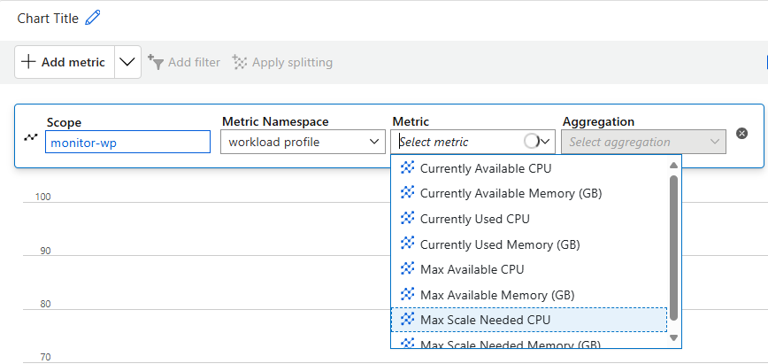
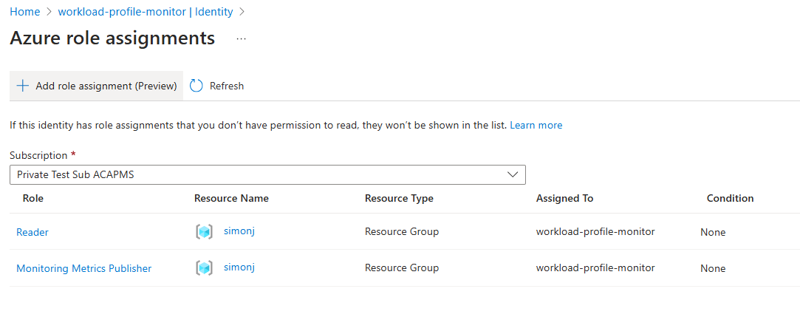
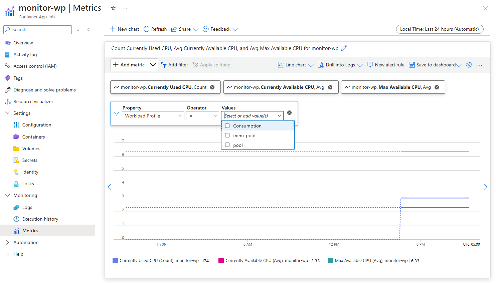

# Workload Profile Monitoring for Azure Container Apps

This is a script designed to monitor and assess the provisioning of Azure Container Apps (ACA) environments and their associated workload profiles. It gathers resource usage data, evaluates if the resources are underprovisioned, and sends metrics to Azure Monitor. From there the metrics can be used to build dashboards or alert upon. The script also produces messages to stdout in case of a underprovisioning scenario.



## Quickstart

This quickstart assumes you have an existing Azure Container App environment already.

```
export SUBSCRIPTION_ID=<ACA_ENVIRONMENT_SUBSCRIPTION>
export RESOURCE_GROUP=<ACA_ENVIRONMENT_RESOURCE_GROUP>
export ENVIRONMENT_NAME=<ACA_ENVIRONMENT_NAME>
export JOB_NAME=workload-profile-monitor

# we create the job first and enable managed identity
az containerapp job create \
  --name $JOB_NAME \
  --resource-group $RESOURCE_GROUP \
  --environment $ENVIRONMENT_NAME \
  --cpu 0.5 \
  --memory 1.0Gi \
  --image simon.azurecr.io/aca-wp-monitor:latest \
  --mi-system-assigned \
  --env-vars SUBSCRIPTION_ID=$SUBSCRIPTION_ID RESOURCE_GROUP=$RESOURCE_GROUP ENVIRONMENT_NAME=$ENVIRONMENT_NAME \
  --replica-timeout 3600 \
  --replica-retry-limit 3 \
  --replica-completion-count 1 \
  --parallelism 1 \
  --trigger-type Schedule \
  --cron-expression "0 */1 * * *"

# we retrieve the managed identity to use for role assignments
PRINCIPAL_ID=$(az containerapp job show --name $JOB_NAME --resource-group $RESOURCE_GROUP --query "identity.principalId" --output tsv)

# we assign the Reader role to be able to get the app and workload profile details
az role assignment create --assignee $PRINCIPAL_ID --role Reader --scope /subscriptions/$SUBSCRIPTION_ID/resourceGroups/$RESOURCE_GROUP

# we assign the Monitoring Publisher Role to be able to send the metrics to the job's metrics panel
az role assignment create --assignee $PRINCIPAL_ID --role "Monitoring Metrics Publisher" --scope /subscriptions/$SUBSCRIPTION_ID
```
Once complete the roles screen for the job's managed identity should look similar to this screenshot:




## Details and Notes
- This script is intended to be run as a job and inside the ACA environment you intend to monitor.
- It uses system assigned managed identity to authenticate itself as both a *Monitoring Metrics Publisher* and *Reader*. These roles will have to be set up.
- Metrics are published and available on its Metric tab.
- The script requires the following environment variables to be provided to it `SUBSCRIPTION_ID`, `RESOURCE_GROUP`, `ENVIRONMENT_NAME`. A forth one (`CURRENT_APP_NAME`) will be provided automatically as part of the runtime environment.
- The script uses [Azure's Python SDK](https://learn.microsoft.com/en-us/azure/developer/python/sdk/azure-sdk-overview).


## Available Metrics & Output
| Metric or Output                | Description                                                                 |
|---------------------------------|-----------------------------------------------------------------------------|
| Workload Profile                | The name the workload profile. This is represented as a dimension and can be access via filters. |                            
| Currently Used CPU              | The amount of CPU currently being used across all the apps and their currently running replicas on the workload profile. |
| Currently Used Memory (GB)      | The amount of memory currently being used across all the apps and their replicas on a workload profile. |
| Currently Available CPU         | The amount of CPU currently available on the workload profile. |
| Currently Available Memory (GB) | The amount of memory currently available on the workload profile. |
| Max Scale Needed CPU            | The maximum amount of CPU needed if all the apps on a workload profile would run at maximum scale. |
| Max Scale Needed Memory (GB)    | The maximum amount of memory needed if all the apps on a workload profile would run at maximum scale. |
| Max Available CPU               | The maximum amount of CPU available if the workload profile would be scaled to the maximum. |
| Max Available Memory (GB)       | The maximum amount of memory available if the workload profile would be scaled to the maximum. |
| Provisioning Assessment         | An assessment of whether Max Scale (CPU or Memory) exceeds Max Available (CPU or Memory). This output gets produced to stdout. |


## Usage
Once gathered metrics become available under the Metrics panel for the job. The metric namespace is *workload profile*. All aggregations show the same number for any collection cycle. Individual workload profile are available via dimensional values and can be access via filters.



The most high-level view gets provided via the console execution log. In case of a underprovisioned scenario a message following this example will be printed:

```
WARNING: Workload Profile mem-pool is underprovisioned: CPU underprovisioned by 4.0 vCPUs. Memory underprovisioned by 38.0 GB.
```


## Limitations and Todo
- Only Apps are considered during the assessment. Jobs are currently not part of the assessment.
- GPU-based workload profiles are not included in the assessment.